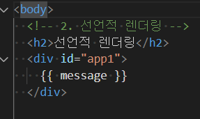
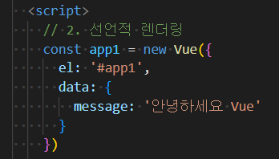
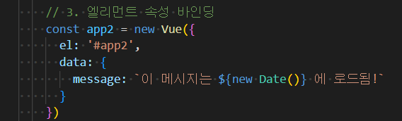
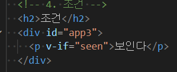
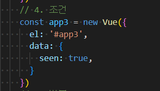
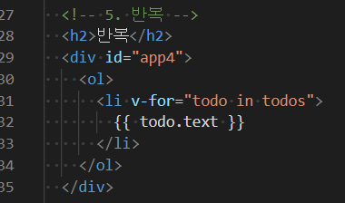
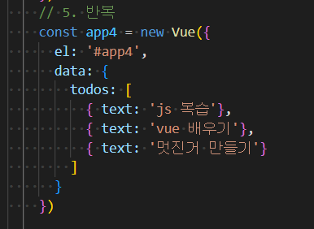
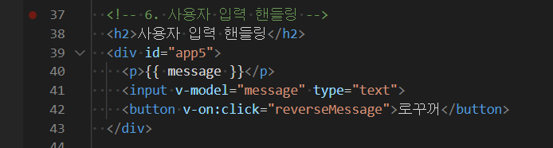
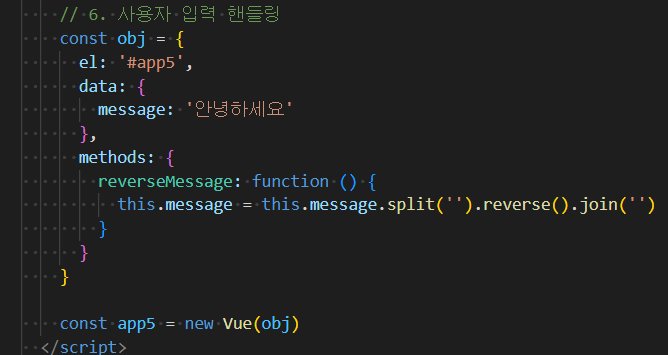

# vue : quickstart

vue cdn 삽입(  <script src="https://cdn.jsdelivr.net/npm/vue/dist/vue.js"></script>)


선언적 렌더링

```
데이터를 수정함과 동시에 알아서 페이지가 바뀐다
```








조건



v-if : vue에게 일을 시키기 위한 지시



이 경우에 '보인다' 보임










methods는 화살표 함수 사용 불가능

-------------------

v-model 페이지 내 input태그와 페이지에 나타나는 걸 연동

엘리먼트에 이벤트 리스너를 연결할 수 있다.

이벤트 유형은 전달인자로 표기

특정 이벤트가 발생했을 때 주어진 코드가 실행 된다.

-------------------

```
<button v-on:click="alertHello">Button</button>
<button @click="alertHello">Button</button>
이렇게 축약할 수 있다.
```


