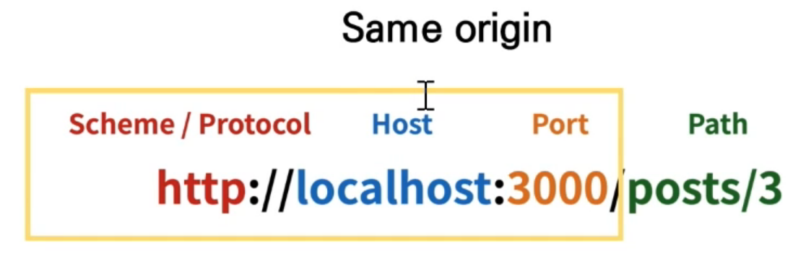
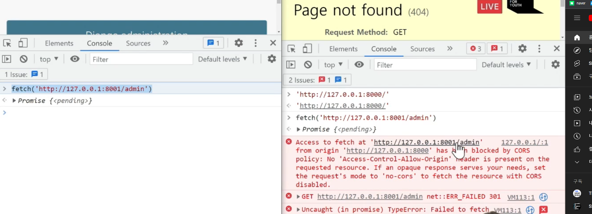
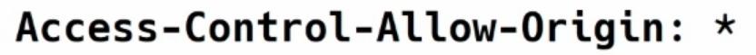
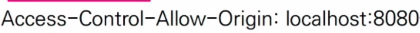
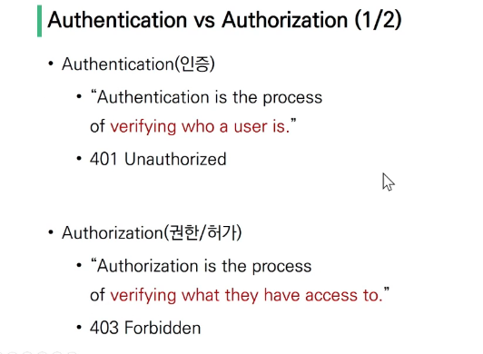
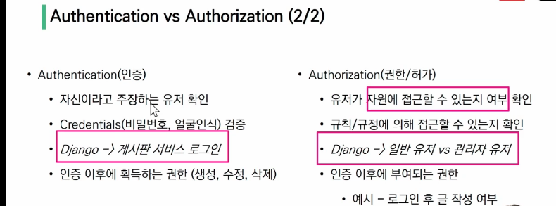
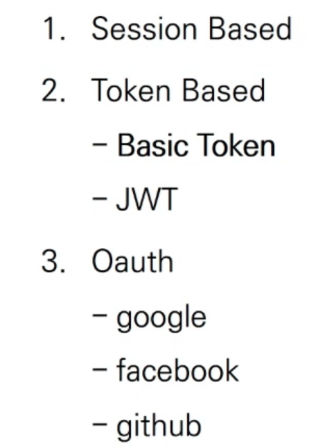
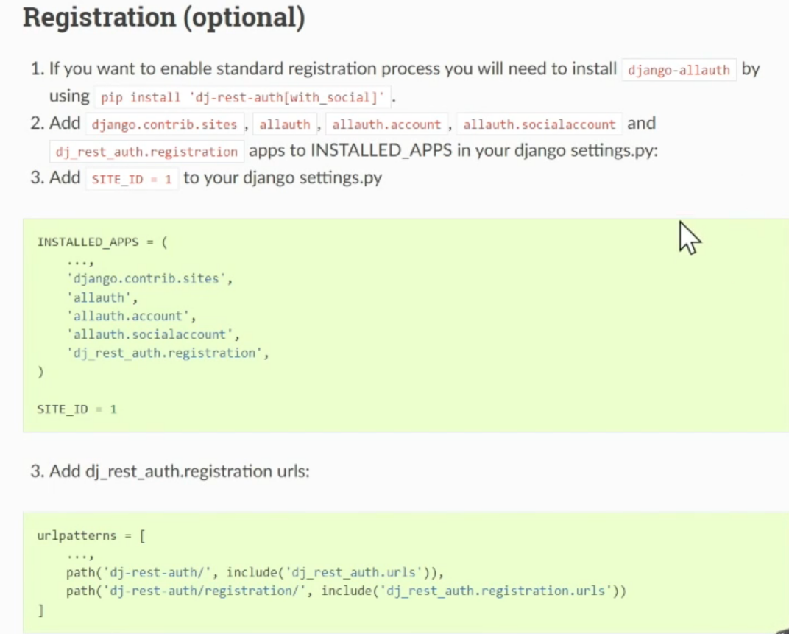
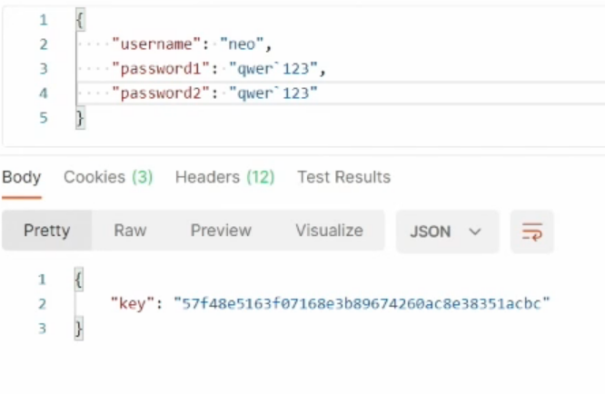
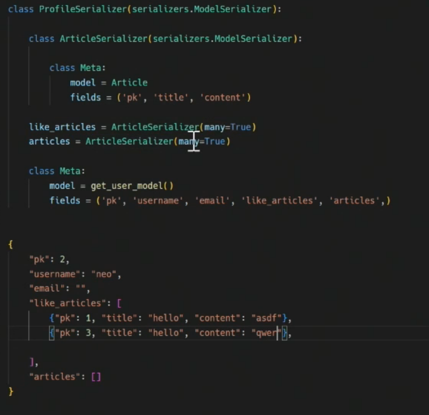

# 시작하기 전에 복습 사항


python -m venv venv

source venv/Scripts/activate

pip install django==3.2.12 djangorestframework django_extensions

pip freeze > requirements.txt

django-admin startproject djangoplace .

touch .gitignore

gitignore 작성

python manage.py startapp accounts

python manage.py startapp articles

settings에서 만든 앱 설치한 앱 추가, AUTH_USER_MODEL = 'accounts.User'


accounts앱 models에 확장

```
from django.db import models
from django.contrib.auth.models import AbstractUser


class User(AbstractUser):
    pass
```

articles앱 models에 확장

```
from django.db import models
from django.conf import settings

class Article(models.Model):
    user = models.ForeignKey(settings.AUTH_USER_MODEL, on_delete=models.CASCADE, related_name='articles')
    title = models.CharField(max_length=100)
    content = models.TextField()
    created_at = models.DateTimeField(auto_now_add=True)
    updated_at = models.DateTimeField(auto_now=True)
    like_users = models.ManyToManyField(settings.AUTH_USER_MODEL, related_name='like_articles')


class Comment(models.Model):
    user = models.ForeignKey(settings.AUTH_USER_MODEL, on_delete=models.CASCADE, related_name='comments')
    article = models.ForeignKey(Article, on_delete=models.CASCADE, related_name='comments')
    content = models.CharField(max_length=200)
    created_at = models.DateTimeField(auto_now_add=True)
    updated_at = models.DateTimeField(auto_now=True)
```

User가 article, comment을 1대 N으로 가지고 있을 거고

articler과 comment사이는 자기들끼리 1대 N

 ```
 # 프로젝트/urls.py
 path('api/v1/articles/'#이라는 이름의 요청이 들어오면, include('articles.urls'#로 포워딩하겠다.))
 
 path('api/v1/accounts/', include('accounts.ruls'))
 
 # 물론 두 앱 다에 urls.py를 만들어 준다!
 ```


```
accounts/urls.py
articles/urls.py
from django.urls import path
from . import views

app_name = 'accounts'#articles

urlpatterns = [
	
]

#서버를 돌리기 위해 필요한 작업이다
```

python manage.py makemigrations 를 통해 모델링한거 반영해줍시다

python manage.py createsuperuser를 통해 관리자계정을 만들자


모델은 어떤 데이터를 실행할지담당하고 시리얼라이저는 그 데이터는 어떻게 표현할지를 담당하고 검증을 담당한다.


serializers.py를 아티클 앱에 추가

생성, 조회, 수정을 할 때 얘내들을 쓸 건데 다양하게 만들자

아티클즈에 동명 폴더를 만들고 article.py와 comment.py라는 파일을 여기에 만들자

```
articles/serializers/article.py

from rest_framework import serializers
from django.contrib.auth import get_user_model

from ..models import Article
from .comment import CommentSerializer

User = get_user_model()


class ArticleSerializer(serializers.ModelSerializer):
    
    class UserSerializer(serializers.ModelSerializer):
        class Meta:
            model = User
            fields = ('pk', 'username')
	#유저를 추가로 시리얼라이즈한다.(from django.contrib.auth import get_user_model)
    comments = CommentSerializer(many=True, read_only=True)
    user = UserSerializer(read_only=True)
    like_users = UserSerializer(read_only=True, many=True)
	코멘트는 밖에 있는 걸 그대로 들고 오고
    class Meta:
        model = Article
        fields = ('pk', 'user', 'title', 'content', 'comments', 'like_users')
	#필요한 요소들 삽입

# Article List Read
class ArticleListSerializer(serializers.ModelSerializer):
    class UserSerializer(serializers.ModelSerializer):
        class Meta:
            model = User
            fields = ('pk', 'username')

    user = UserSerializer(read_only=True)
    # queryset annotate (views에서 채워줄것!)
    comment_count = serializers.IntegerField()
    like_count = serializers.IntegerField()

    class Meta:
        model = Article
        fields = ('pk', 'user', 'title', 'comment_count', 'like_count')
```

serializers.py의 양이 너무 커서 쪼갠건데


# CORS

동일 출처에서 불러온 스크립트만 받아주겠다.

동일 출처란 URL에서 scheme, protocol, host, port 부분이 전부 동일한 부분만을 의미한다.





완전히 같은 동일출처에서만 요청을 보낼 수 있다

서버는 똑바로 할 일 했는데 브라우저의 CORS라는 정책에 의해 막혔다는 거

동일 출처 정책 - 특정 출처에서 불러온 문서 또는 스크립트가 다른 출처에 의한 상호작용 금지


그러면 그 해결책은?
CORS header

------------------------------------


교차Cross 출처 Origin 자원Resource 공유Sharing( CORS )

추가 http header 사용하여 특정 출처에서 실행중인 웹 애플리케이션이 다른 출처의 자원에 접근할 수 있는 권한을 부여하도록 브라우저에 알려주는 시스템

서버에서 헤더를 추가해줘야한다. 그래서 어떤 호스트에서 자신의 컨텐츠를 불러갈 수 있는지 서버에 지정해 주어야 하지.



모든걸 다 허용하는 옵션



특정 요청에 대해서만 허용하는 옵션

django-cors-headers : django에서 cors에 필요한 옵션

```
$ pip install django-cors-headers
```

마찬가지로 settings에 추가

미들웨어에서는

```
corsheaders.middleware.CorsMiddleware
```

는 commons보다 앞에 추가해야 한다.

그 다음엔 무엇에 교차출처를 허용할 지 추가하자

```
# 특정 origin 에게만 교차 출처 허용
CORS_ALLOWED_ORIGINS = [
     # Vue LocalHost
     'http://localhost:8080',
     'http://127.0.0.1:8001',
 ]

# 모두에게 교차출처 허용 (*)
CORS_ALLOW_ALL_ORIGINS = True

```

# _2_Authentication & Authorization

인증과 허가





# DRF

지금까지 우리가 쓰던 세션 베이스 외에 토큰 베이스, Oauth 등 인증방식이 있다.



## 베이직 토큰 인증

로그인 할 때 서버에 json데이터를 보내면서 시작된다. 서버(django)측에서 올바른 사용자라고 인식이 되면 새로운 테이블을 생성하고 pk번호와 토큰값을 준다.


클라이언트는 토큰 값을 저장하고 요청 헤더에 토큰값을 넣고 보내면 서버에서 읽고 인식한다.

## JWT(적극적으로 사용하지는 않는다)\

JSON 포맷을 활용하여 요소간 안전하게 정보를 교환하기 위한 표준 포맷

# DRF Authentication

```
pip install django-allauth
pip install dj-rest-auth
```


어카운트 앱에서 예전에는 회원가입 로그인 로그아웃 코드를 만들었잖아.  솔직히 그다지 달라지는 거 없고 사이트에도 다 나와있다. 


```
settings.py의 설치된 앱에
'rest_framework_authtoken'이라는 토큰기반의 auth를 추가
'dj_rest_auth'이라는 signup 제외 auth 담당을 추가

```

```
# DRF 인증 관련 설정
REST_FRAMEWORK = {
    'DEFAULT_AUTHENTICATION_CLASSES': [
        'rest_framework.authentication.TokenAuthentication',
    ],#인증은 토큰으로 할 게획
    'DEFAULT_PERMISSION_CLASSES': [
        # 모두에게 허용
        # 'rest_framework.permissions.AllowAny', 

        # 인증된 사용자만 모든일이 가능 / 비인증 사용자는 모두 401 Unauthorized
        'rest_framework.permissions.IsAuthenticated'
    ]
}

```

```
프로젝트 urls.py에도
path('dj_rest_auth/', include('dj_rest_auth.urls'))
추가. 이렇게 하면 /뒤에 url이 쫙 붙게 될 것.
```

이 설정으로 DB안에 토큰탭이 나오고  기본 페이지에 dj-rest-auth로 가라는 지시가 생기게 됨.

postman- post -json 설정으로 json형식으로 기입

이렇게 보내면 키의 토큰값이 데이터베이스에 입력된 거 확인 가능


사실 dj-rest-auth라는 말은 별로다.

```
path('api/v1/accounts/', include('dj_rest_auth.urls'))
```

로 바꿔볼까


로그아웃 할 때는 또 리퀘트흐 헤더에 토큰값을 밸류에 넣어줘야

만약 토큰값이 틀리면 잘못되었다고 결과가 나오겠지

결국 DB에 create= login, delete=logout, Read=토큰검증

---------

가입하려면 allauth설치하고, installed apps와 사이트아이디, url패턴에 이거만 해 주면 끝나.



```
다시 settings.py의 설치앱에서 
'django.contrib.sites',#[rest auth signup에 필요하다]과 SITE_ID = 1을 넣어주자.
이외에도 'allauth', 'allauth.account' 'allauth.socialaccount', 'dj_rest_auth.registration',  # signup 담당
추가
```

```
urls.py 가서 path('api/v1/accounts/signup/', include('dj_rest_auth.registration.urls') 추가해주고
```

이러면 signup까지 추가.(중간에 migrate 까먹지 말 것)

postman을 통해 signup을 post방식으로 보고 또 json 방식으로 이걸 추가해보자



얘는 우리가 건든 게 없는데 알아서 회원가입 과정을 해 준다. 이 토큰을 받아서 쓰자

-------------------

커스텀을 살짝만 해봅시다

accounts/views.py에 필요한 각종 함수들은 이미 이전과정에서 다 만들었기에 쓸모가 없지만

```
def profile(request, username):
	pass......
	
	넣은 뒤 accounts/urls.py에도 필요한 것을 삽입

```

그 다음에도 accounts에 시리얼라이즈를 만들어서

```
from rest_framework import serializers
from django.contrib.auth import get_user_model

class ProfileSerializer(serializers.ModelSerializer):

    class Meta:
        model = get_user_model()
        fields = ('pk', 'username', 'email', 'like_articles', 'articles',)#프로필 페이지에서 여기에서 또 작성한 게시글, 좋아요 게시글을 보여주려면 articles를 정의해야 한다.


대충 여기까지 만들면 또 views.py에 serializers를 import 해 줘야겠지. 그리고 과거의 기억을 활용해서 작성해 보자
```

이 article을 정의하기 위해서 또 시리얼라이즈에 작성

```
class ProfileSerializer(serializers.ModelSerializer):

    class ArticleSerializer(serializers.ModelSerializer):
        
        class Meta:
            model = Article
            fields = ('pk', 'title', 'content')

    like_articles = ArticleSerializer(many=True)
    articles = ArticleSerializer(many=True)

```

이 아티클과 라이크아티클이 단순히 1, 2, 3이 아니게[ 하기 위해] from articles.models import Article

그러면 단순히 1, 2, 3을 가져오는게 아니라 실제로 필요한 것 들을 가져오게 된다.




20:00~30:00 serializer와 view는 조금 더 보자


### articles/urls.py

에도 제각기 필요한 내용을 추가하고


```
from django.urls import path
from . import views

app_name = 'articles'

urlpatterns = [
  \# articles
  path('', views.article_list_or_create),
  path('<int:article_pk>/', views.article_detail_or_update_or_delete),
  path('<int:article_pk>/like/', views.like_article),
  \# comments
  path('<int:article_pk>/comments/', views.create_comment),
  path('<int:article_pk>/comments/<int:comment_pk>/', views.comment_update_or_delete)
]
```

다시 로그인 과정 등을 수행하기 위해서는 헤더에 토큰값을 입력해야 한다(=로그인)

```
settings.py에서 

REST_FRAMEWORK = {
    'DEFAULT_AUTHENTICATION_CLASSES': [
        'rest_framework.authentication.TokenAuthentication',
    ],
    'DEFAULT_PERMISSION_CLASSES': [
        # 모두에게 허용
        # 'rest_framework.permissions.AllowAny', 

        # 인증된 사용자만 모든일이 가능 / 비인증 사용자는 모두 401 Unauthorized
        'rest_framework.permissions.IsAuthenticated'
    ]
}
```

인증된 사용자만 모든 게(views.py의 실행) 다 가능하게 해야 하지만 login과 signup이 가능하게 해야

