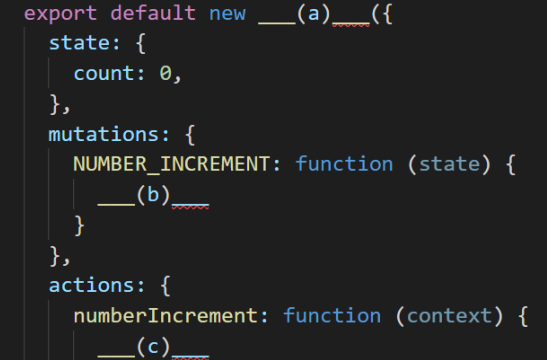
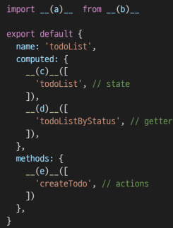

# vuex

데이터 state를 전역 저장소로 관리하는 라이브러리. 여러 컴포넌트 내부의 특정 state를 중앙에서 관리하게 됨. 

부모에서 자식에의 전달만 가능한 단방향 데이터 흐름. 반대의 경우 이벤트를 트리거.

mutation : 유일한 state 변경, 첫 번쨰 인자로 state만 받고, 반드시 동기적에, actions에서 commit()매서드로 호출

action : mutation을 커밋으로 호출. 비동기 작업일 수 있음. context 객체 인자 받고, 컴포넌트에서 dispatch()매서드로 호출

getters : state를 활용하여 계산, computed와 유사, 저장소의 상태 기준으로 계산, getters의 결과는 state 종속성에 따라 cached되고 종속성이 변경된 경우에만 재계산됨

store/index.js : vuex core 컨셉트가 작성됨.

vuex store에 모든 상태를 넣어야 하는건 아님. $store.state를 통해 개별 컴포넌트에서 데이터 접근

actions의 context 객체 : 전반적 속성 포함, 그래서 context.commit으로 mu호출, state로 접근, getters로 접근, dispatch로 ac에 접근 가능

mutations함수의 이름은 상수로

자바스크립트 spread syntax : 전개 구문, 반복 가능한 문자를 요소로 확장하여 0개 이상의 key-value쌍 객체로 확장 가능

...을 붙여서 반복가능객체를 하나의 객체로 표현

컴포넌트 바인딩 헬퍼(배열조작이 편해지지만 코드가 변하진 않는다)

map...

vuex-persistedstate : vuex state를 자동으로 브라우저의 LocalStorage에 저장해주는 라이브러리 중 하나. 페이지가 새로고침 되어도 vuex state를 유지시킴

-----------------------

상태정의 state 필터링 getter 

a) Vuex Store b) state.count++ c) context.commit('NUMBER_INCREMENT')

a-{mapState, mapGetters, mapActions} b-'vuex' cde = ...a

 

mutations만 변경하는 이유 : 여러 개의 컴포넌트에서 state 변경하면 추적하기가 어렵다. 특정 시점에 어떤 컴포넌트?

단방향인 이유 - 하위컴포넌트가 실수로 변경하는 일 없애려고

native : 하위컴포넌트 이벤트를 상위에서 실행하는 수식어

