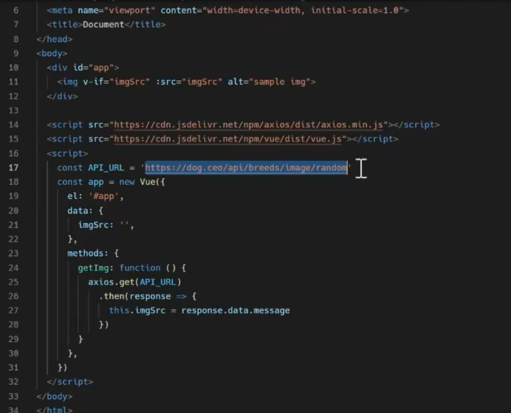
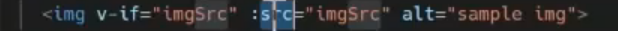
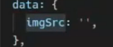

imgsrc에 유의미한 값이 있다면 이 태그가 보이는데



초기값이 빈 스택이면 아무거도 없다

언젠가 의미 있는 값이 들어올 때를 위해 :src로 바인드를 걸어놓음

alt sample img는 큰 의미가 없다


어쨌든 현재는 비어 있는데 이 매서드에서 getImg를 실행하자.

axios.get(API_URL)은 const API_URL에서 값을 가져온다. 그렇다면 그 가져온 걸 받아서(response) 성공했다면(.then), this.imgsrc를 받은 데이터(response.data.message)로 갱신한다.

```html
<button @click="getImg">GetDog</button>를 어찌 되었든 간에 걸어준 다음에
```

모든 vue instance는 created후 초기화, mounted, update, destroy

Vue 인스턴스가 const와 연결된 후에야 완성

Vue인스턴스 바로 뒤에 이걸 입력하면

```
created: function() {
	console.log('Created! but not beforeMount...')
}
```

이렇게 하면 인스턴스가 완료된 후에 바로 실행되지만 

```
created: function() {
	this.getImg()
}
```

(스코프 안에 없으니 this를 붙여주고)getImg 실행. 이렇게 되면 vue인스턴스가 생성된 후에 이 함수를 실행한다.

이것이 라이프사이클훅이라고 할 수 있다.

사이클의 시점시점마다 내가 원하는 걸 넣어두자

created가 대부분이고 거의 외부 API에서 초기 데이터를 받아온다.